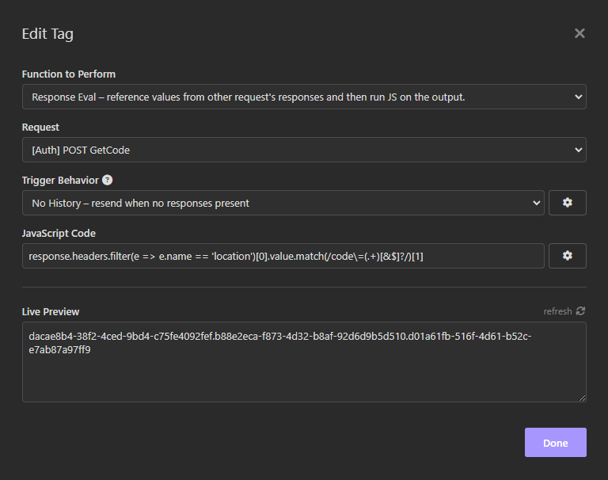

# Insomnia Response-Eval Template Tag

You can think of this as a combination of [`insomnia-plugin-response`](https://www.npmjs.com/package/insomnia-plugin-response) and [`insomnia-plugin-js-eval`](https://www.npmjs.com/package/insomnia-plugin-js-eval).

## Installation
Install the `insomnia-plugin-response-eval` plugin from Preferences > Plugins.

## Usage

